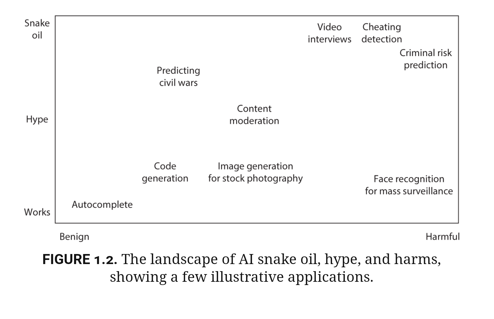

# Chapter 1 - Introduction

## Open Access to the Introduction

The publisher's - Princeton University Press (PUP) - website for the book has open access to the _Introduction_ chapter, the book's table of contents and the book's index[^AISnakeOilIntroduction].

## The Landscape of AI Snake Oil, Hype and Harms

We reproduce *Figure 1.2* _The landscape of AI snake oil, hype and harms, showing a few illustrative applications_. 

- _Autocomplete_: 

- _Cheating detection_:

- _Code generation_ aka _vibe coding_: 

_Vibe coding is like playing archeologist in someone else's mistakes_

_Using AI to generate code for you doesn't eliminate the work—it just shifts it from writing to explaining and reviewing, which isn't always a win._[VibeCodingLinkedIn]

- _Content moderation_:

- _Criminal risk prediction_:

- _Face recognition for mass surveillance_: [^YourFaceBelongsToUs]

- _Image generation for stock photography_:

- _Predicting civil wars_

- _Video interviews_:

## Pre-reading notes for the reading group discussionon Chapter 1

Brandon's pre-reading notes for the reading group discussion on Chapter 1 _Introduction_ is in the [PDF file AISnakeOilChapter1Brandon](AISnakeOilChapter1Brandon.pdf).

## REFERENCES

[^AISnakeOilIntroduction]:	
	https://press.princeton.edu/books/hardcover/9780691249131/ai-snake-oil#preview
	
[WhatIsVibeCoding]:
    Kozyrkov C. _What is Vibe Coding: why you wouldn't want to do it and why you would ..._, *Decision Intelligence*, 31 March 2025.
	https://decision.substack.com/p/what-is-vibe-coding
	
[VibeCodingLinkedIn]:
    Kozyrkov C. _Vibe coding is like playing archeologist in someone else's mistakes_, 
	https://www.linkedin.com/posts/kozyrkov_vibe-coding-is-like-playing-archeologist-activity-7318623860679991297-jbsp/
	
[^YourFaceBelongsToUs]:
    Hill K. _Your Face Belongs to Us: A Secretive Startup's Quest to End Privacy as We Know It_. New York: Random House; 2023.
	
	

