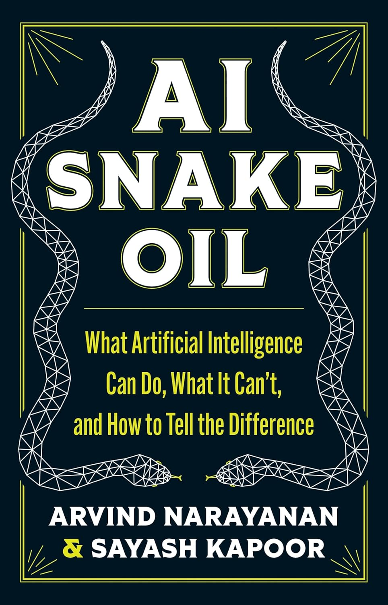

# AI Snake Oil Reading Group

This is a basic repository supporting a reading group for the book _AI Snake Oil: What Artificial Intelligence Can Do, What It Can't and How to Tell the Difference_[^AISnakeOilBook] by Arvind Narayanan and Sayash Kapoor published by Princeton University Press[^PUP].

## Discussion sessions - Google Meetme

| Week  | Spotify playlist                                      | Session Leader |
|------ |-------------------------------------------------------|----------------|
| 0     | [Bonus track](BonusTrack)                             | Andrew         |
| 1     | [Chapter 1](Chapter1-Introduction)                    | Brandon        |
| 2     | [Chapter 2](Chapter2-HowPredictiveAIGoesWrong)        | Daryl          |
| 3     | [Chapter 3](Chapter3-WhyCantAIPredictTheFuture)       | David          |
| 4     | [Chapter 4 i](Chapter4-TheLongRoadToGenerativeAI)     | Amy            |
| 5     | [Chapter 4 ii](Chapter4-TheLongRoadToGenerativeAI)    | Simon          |
| 6     | [Chapter 5](Chapter5-IsAdvancedAIAnExistentialThreat) | Joe            |
| 7     | [Chapter 6 i](Chapter6-WhyCantAIFixSocialMedia)       | Jake           |
| 8     | [Chapter 6 ii](Chapter6-WhyCantAIFixSocialMedia)      | Kara           |
| 9     | [Chapter 7](Chapter7-WhyDoMythsAboutAIPersist)        | Karthik        |
| 10    | [Chapter 8](Chapter8-WhereDoWeGoFromHere)             | Richard        |
| 11    | [Whole Book](WholeBook)                               | Andrew         |

## Glossary

We maintain a [Glossary](Glossary) of terms used in the book, for example the author's definition of "AI Snake Oil".

## Book Website, Blogs and Supplementary Material

The authors maintain a website[^AISnakeOilWebSite] for the book containing Blogs and Supplementary materials, including exercises and discussion notes for each chapter[^AISnakeOilExercises].

## REFERENCES

[^AISnakeOilBook]:
    Arvind Narayanan and Sayesh Kapoor **AI Snake Oil**: _What Artificial Intelligence Can Do, What It Can't, and How to Tell the Difference_ Princeton University Press 24 September 2024 ISBN 9780691249131
	
[^PUP]:       
    https://press.princeton.edu/books/hardcover/9780691249131/ai-snake-oil

[^AISnakeOilWebSite]:
    https://www.aisnakeoil.com/ - "Debunking AI hype. The book gives you foundational knowledge and the newsletter covers new developments."

[^AISnakeOilExercises]:	
	https://www.aisnakeoil.com/p/ai-snake-oil-exercises-and-discussion
 
