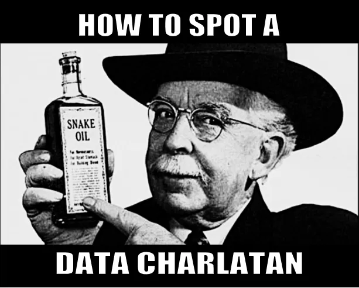

# Review of the Whole Book

## TLDR - Too Long, Didn't Read

- uneven
- naive
- generates good discussion

## Examples of AI Snake Oil characterised by 3 points

- Bad Data Science
- Asking algorithm to do stuff it can't
- Misinterpret what AI can do - buy-in to the hype

## Regulation, Safety and Evaluation

- Governments buying tools without vetting

## How to spot a Data Charlatan[^DataCharlatan]

## Best when explained in a holistic way

- Social context

## Change to the nature of work

- Co-Intelligence
- Human becoming Janitor to AI?
- AI good enough applications

## Harmful applications

- North Korean: generate personas; faces; CVs; video real-time.

## PodCast -

[^AISnakeOilPodCast]

## REFERENCES

[^DataCharlatan]:
    Cassie Kozyrkov _How to spot a data charlatan: Tips for identifying fakers and neutralizing their snake oil_ **Medium** 9 October 2020 https://medium.com/data-science/how-to-spot-a-data-charlatan-85785c991433
	
	Article best reached via LinkedIn post (access full article without subscribing) https://www.linkedin.com/posts/kozyrkov_how-to-spot-a-data-charlatan-activity-6980955191973928960-l43f
	
[^AISnakeOilPodCast]:
    Thinkers and Ideas Podcast - AI Snake Oil with Sayash Kapoor
	